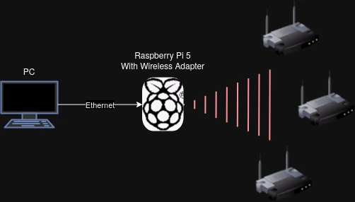
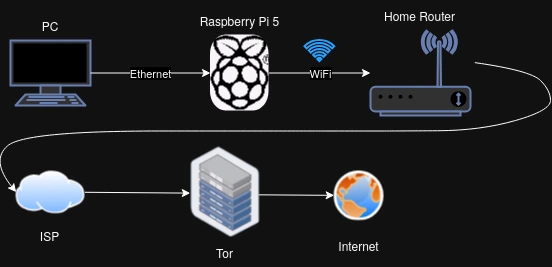
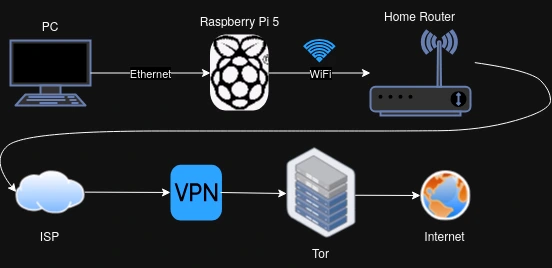
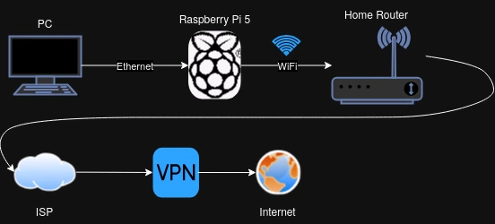

# PiHub  
The "PiHub" is a Raspberry Pi 5 (desktop version), with the a few changes that allow the Raspberry Pi to preform multiple networking related Privacy/Pentesting actions, such as:  

### Become NAT Router (via Ethernet)  
The Raspberry Pi connects to a Wifi network, and routes all the devices connected to it's ethernet interface through that wifi network:  
  
  
To connect to a WiFi network and route all clients through the network use the script `connect_to_wifi.sh`, located on the users desktop.  
It is recommended to use this script every time you connect to a WiFi network.  
The script randomizes your MAC address, configures IPtables to make sure your Raspberry Pi is secure when connected to the network, and more.  
  
### Attack WiFi Networks  
Once connected to the Pi via Ethernet, you can connect a wifi adapter that supports monitor mode, and use the tools that the "PiHub" installs (`Aircrack-NG`, `Wifite`, `Fluxion`, `BeEF`, `Airgeddon`, `AngryOxide` and more) to pentest nearby wifi networks:  
  
  
Once finished installing all programs there will be a script in the users `Desktop` folder named `set_monitor_mode.sh`.  
Use this script to move your Network Adapter between `Managed` and `Monitor` mode, to be able to attack and connect to WiFi networks.  
  
### Route Through Tor  
The "PiHub" can also route itself, and all it's clients, through the Tor network:  
  
  
To do this run the script `route_through_tor.sh` located in the users `Dekstop` folder.  
  
### Route Tor Over VPN  
If you wouldn't like to connect directly to Tor, the "PiHub" can also help you route Tor over VPN:  
  
  
I recommend using `Mullvad VPN` as that is the VPN provider "PiHub" was tested with.  
To use this functionality, run the script `tor_over_vpn.sh` located in the users `Dekstop` folder.  
Of course, you could also simply route the Pi and it's clients only through a VPN, without Tor:  
  
  
## Installation  
To install the "PiHub" on a Raspberry Pi 5, run these commands:  
```bash  
wget https://raw.githubusercontent.com/jakored1/PiHub/refs/heads/main/pihub.sh  
chmod +x pihub.sh  
# Run program with 'sudo', not directly as the 'root' user  
sudo ./pihub.sh -h  
  
# Run with full install  
sudo ./pihub.sh -e eth0 -w wlan0 -n Galaxy --install  
```  
  
## Disclaimer  
Because there is mention of Tor, and WiFi pentesting in this project, I feel I must have a disclaimer.  
I am not responsible for anything done with this setup.  
It is the end user's responsibility to obey the law.  
I assume no liability and am not responsible for any misuse or damage caused by this program directly or indirectly.  
  
# Enjoy!
